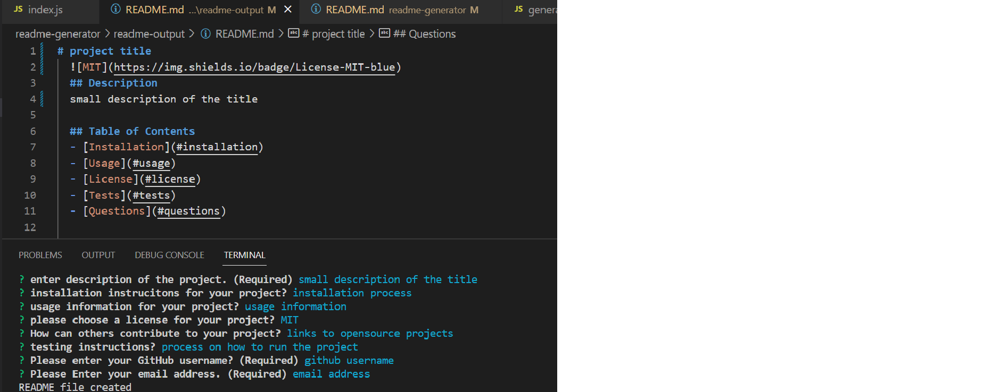

# readme-generator
A readme generator that will take input from the user to create a readme file that will have all the neceassry information such as the project title, description etc. it will be using the node inquirer package for displaying the information in CLI terminal.

## installation
In command line terminal

1. git clone https://github.com/XBaderM/readme-generator.git

2. npm install

3. node index.js

## screenshot

## walkthrough link
[Walkthrough Video](https://watch.screencastify.com/v/LGEDy4ylTKqOvPWceOsR)

## github link
[GitHub Repo](https://github.com/XBaderM/readme-generator/)

